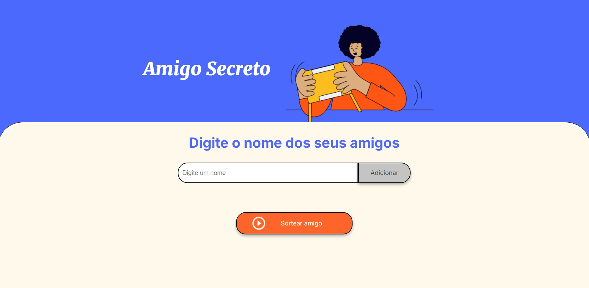
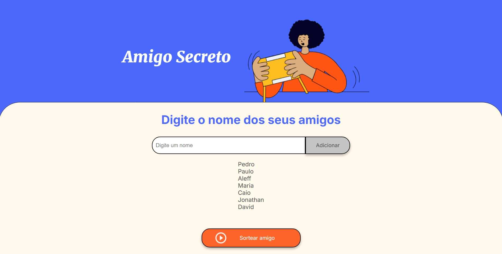
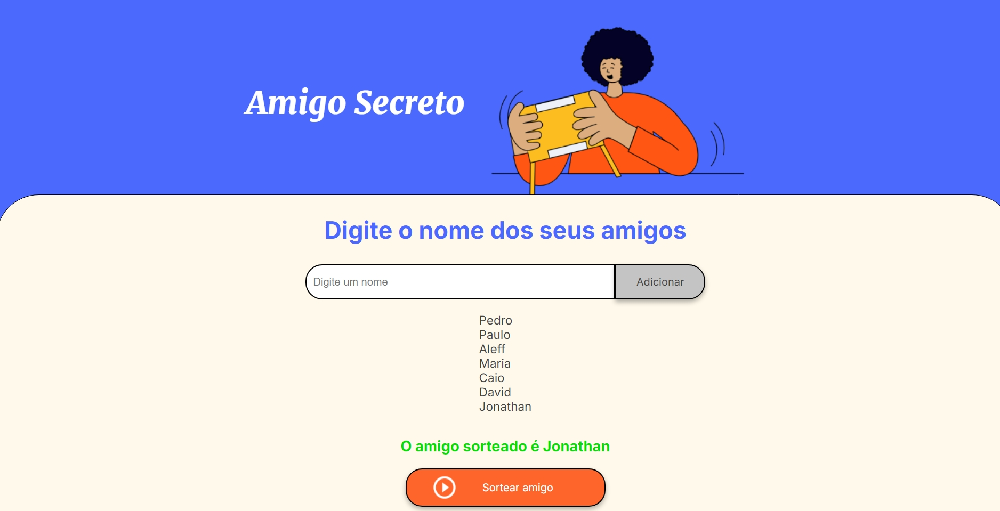

<h1 align = "center"> Jogo Amigo Secreto </h1>

<h2> Como Funciona </h2>

 O usuário insere o nome de seus amigos e, a cada inserção, será possível acompanhar os amigos inseridos. Ao terminar, ele pode clicar no botão "sortear amigo" e, então, aleatoriamente um amigo é sorteado e logo após é informado o nome escolhido.

<h3> Jogo em funcionamento</h3>

<h4>Tela inicial</h4>

<h4>Amigos digitados</h4>

<h4>Amigo Sorteado</h4>
